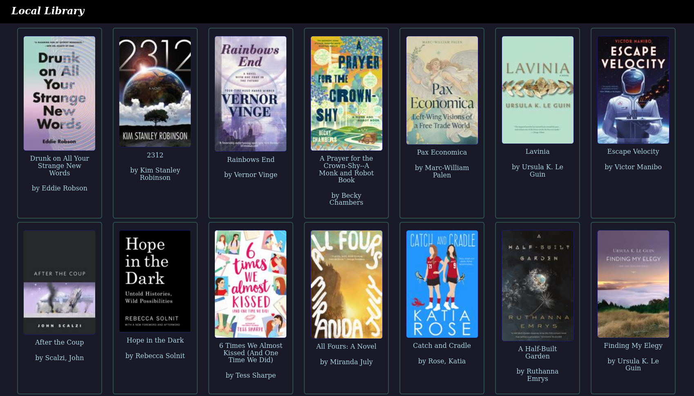

# Local Library
Local Library is a simple read-only ebook library that indexes your `epub` ebooks against a read-only file system and provides a nice UI to browse and download them. For some more color on the intent and architecture of this application, [see this blog post](https://www.leozqin.me/posts/local-library/).

# Running
## Dev
First set the `API_BASE_URL` environment variable to `http://localhost:8000`, either in your profile file, one-off, or using something like `direnv`.

To start the API server, in the repository root, create a fresh Python 3.12 virtual environment. Then, install the `requirements.txt` in that venv. Then, run `fastapi dev` to start the API server.

To start the web interface, first install nodejs 22. Then, navigate to `web` and run `npm install`. Finally, run `npm run dev` to start the web interface on port 4321.

To run both the API and web interface at the same time, you'll need to create separate terminal sessions, of course.

If you're using nix, you can install pre-reqs by doing `nix-shell -p nodejs_22 python312`.

## Docker
Modify [the Compose stack](docker-compose.yml) to your heart's content, and then run `docker compose up` to start the app.
